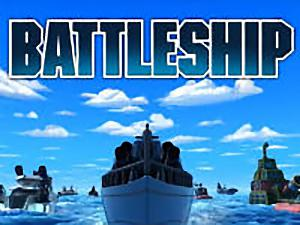
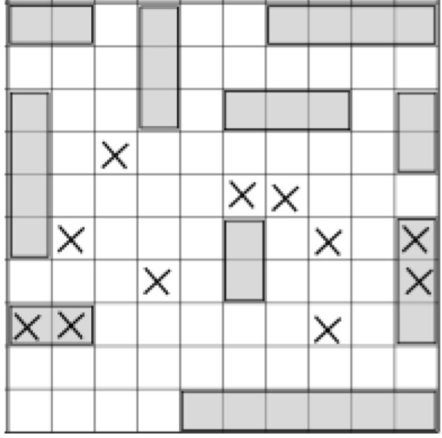

= Coordinates(Estimation)

* Students will review the importance/need for coordinates in a videogame and brainstorm a game of their own*

[.left-header,cols="20a,80a", stripes=none]
|===
|Lesson Goals
|Students will be able to:

* Understand the need for coordinates in a video game.
* Estimate coordinates given a screen resolution.

|Student-Facing Lesson Goals
|
* I can estimate coordinates given a specific screen resolution
* Collaborate with a partner to brainstorm a videogame
* Use Google Draw to create a mock-up Screenshot(proof of concept) of their video game.

|Key Points for the Facilitator
|
* The launch activity should create and reinforce the need for coordinates and to attend to precision.
* Continue to use the same "Estimation" handout so students can track their pattern of estimation over time.

|Prerequisites
|
* Students should be familiar with the Coordinate Plane.

|Materials
|
* https://docs.google.com/presentation/d/197qEduqpIWLrJR38mgk5aga-8qcT9apEcIif9sr5RbM/edit#slide=id.g43c588b89e_1_5[Google Slides] for this lesson.
* Links to printables, activities, etc., go here
|===

[.left-header,cols="20a,80a", stripes=none]
|===
|Math Standards (CCSS)
|
* http://www.corestandards.org/Math/Practice/MP2[CCSS.MATH.PRACTICE.MP2],
Reason abstractly and quantitatively.

|CS Standards (CSTA)
|
* CS Standards here.
|===

== Get Ready:

Students should have their computer, and pencil or pen. Students should be logged into WeScheme.

== Launch: (5 min)

Have students look at the Battleship Grid Image(without labels) and notice the hits and misses.  Ask students where they would fire next to try and hit one of the battleships.

BattleShip

== Discuss: (5 min)

* What can help us be more precise in playing Battleship?
* How do you think this concept relates to a videogame?

== Explore: (10 min) Ninja Cat Desmos Graph

In pairs, have students explore https://www.desmos.com/calculator/pbm9nxr2rd[the Ninja Cat Desmos graph] in the 3 different environments.

[.notice-box]
.Notice and Wonder
****
As one partner explores the graph, the other student will write down what they notice.

As one partner explores the graph, the other student will write down what they wonder.
****

== Practice: (15 min) Estimation 180 Activity - Ninja Cat 

Have students practice their estimation skills and analyze their absolute error and percentage error along the way.

Talking Points
* Why do we estimate?
* What constitutes a good estimate?
* How can we improve our estimation skills?

== Create/Apply: (15 min) Brainstorm a Game - Google Draw
 
Students will https://docs.google.com/document/d/1gM5eqfI-VVzccr_3-UugZWOvYKYKYd_wrOrFyOKoQ0o/copy[brainstorm their video game] and decide on a Player, Target, Danger, and Background.

Students will use https://docs.google.com/drawings/d/1ET8OazCiswbHrx8wyUAsSkcPRcsKC8xVoOJAc1YFKVE/copy[this Google Draw template] to create a Screenshot of their game by inserting images via Google Search.

Screenshot must include
* Labeled estimates of coordinates for each character.
* 2 characters that have the same x coordinate.
* 2 different characters that have the same y coordinate.

