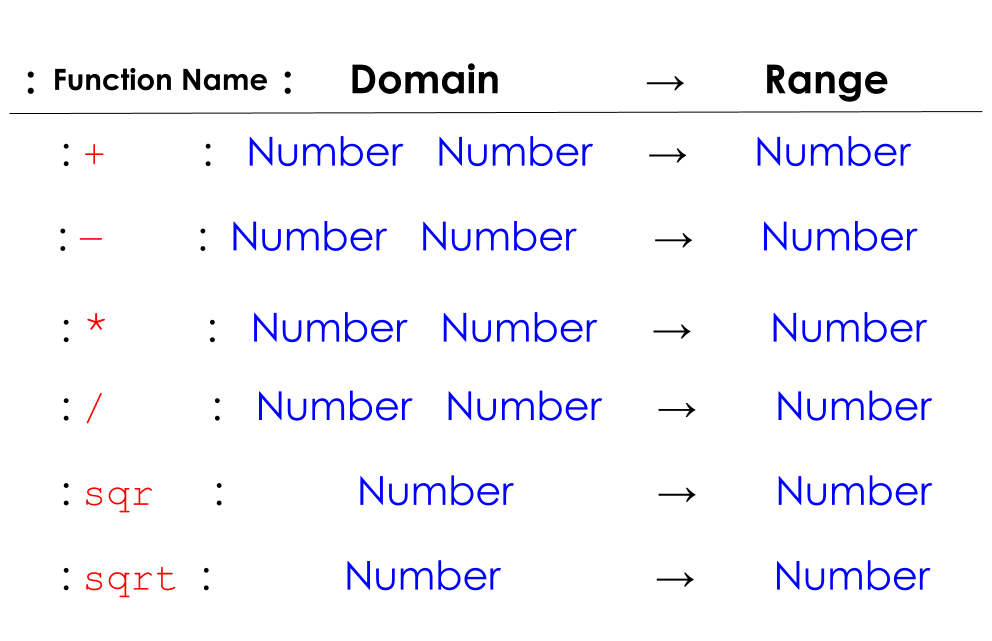
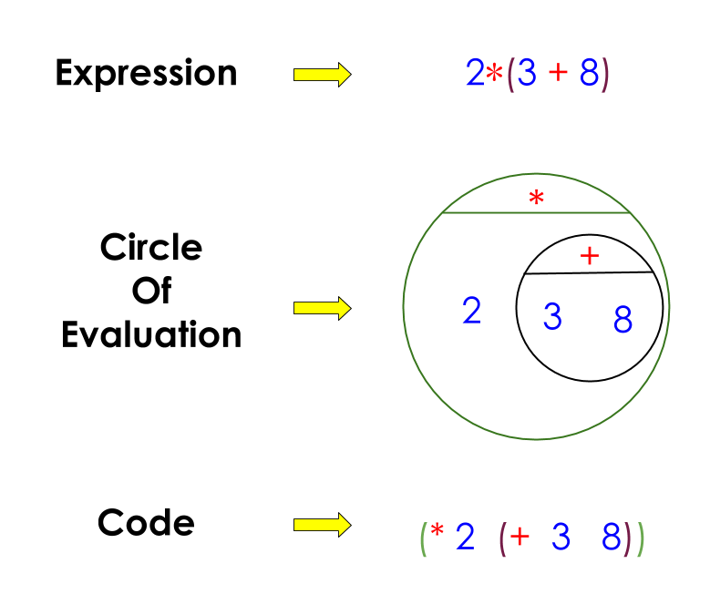

= BSA: G2a - Order of Operations(Circles of Evaluation)
== Big Idea of lesson goes here

[.left-header, cols="20a, 80a", stripes=none]
|===
| Lesson Goals
| Students will be able to:
|
* Goal #1
* Goal #2

|Student-facing Goals
|
* I can...
* I can...
* I can...

|Key Points For The Facilitator
|
* Common student issues

* Pacing suggestions

* Etc

|Prerequisites
|
* Previous lessons linked here

|Materials
|
* Links to printables, activities, etc go here
|===

[.left-header, cols="20a, 80a", stripes=none]
|===
|Math Standards(CCSS)
|
* http://www.corestandards.org/Math/Practice/MP1/[CCSS.MATH.PRACTICE.MP1],  Make sense of problems and persevere in solving them.
* http://www.corestandards.org/Math/Practice/MP2/[CCSS.MATH.PRACTICE.MP2], Reason abstractly and quantitatively.
* Other math standards

|CS Standards(CSTA)
|
* CS Standards here
|===

== Get Ready: 

Students should be logged into WeScheme.

== Launch: (8 mins)
Option 1: Watch the https://www.youtube.com/watch?v=y9h1oqv21Vs[PEMDAS is wrong] video with students then ask students what they thought of the video and what they think/know of PEMDAS.
 (Suggestion: watch the video at 0.5 speed because they talk really fast).  

Option 2: Have students evaluate the expression in the image below and gather a few responses from the students.  Discuss some of the issues mentioned in this Slate article, What Is the Answer to That Stupid Math Problem on Facebook?.

                                                 

== Explore: (5 mins) Let There Be Numbers!
Have students log into WeScheme and explore numbers in WeScheme in the Interactions window.

[.notice-box]
.Notice & Wonder
**** 
In pairs, students will each try entering a variety of numbers in WeScheme, then together they will write down what they notice and what they wonder.
****

== Discuss: (5 mins)
* What type of numbers did you try?
* What did you notice? What did you wonder?
* Did anyone try any irrational numbers? (Ex: pi or e)
* Did you get any error messages?

== Discuss: (7 mins)
* Did anyone try to Add/Subtract/Multiply/Divide numbers? 
* What was the Error Message? 
* How can we Add/Subtract/Multiply/Divide in WeScheme?

=== Direct Instruction:
At this point, you’ll provide some direct instruction on the Circles of Evaluation & Contracts and how to:

* Create a Circle of Evaluation from an expression.
* Convert a Circle of Evaluation into Racket.
* Write the Contract of a function(Name, Domain, & Range).
* Write the 6 contracts for +, -, *, /, sqr, and sqrt into the Contracts page.

[.text-center]Circles of Evaluation

image::images/CoE1.png[Circle of Evaluations, 400, align="center"]
                                          

Contracts

== Practice: (5 mins)  Add/Subtract/Multiply/Divide
Have students practice adding, subtracting, multiplying, and dividing using the 6 functions(+, -, *, /, sqr, sqrt).

== Talking Points
Do spaces matter when typing in functions?
Does the order of the numbers matter in the functions? Which functions?
What do the error messages tell us? 

== Discuss: (10 mins) - Circles of Evaluation w/More than 1 expression

=== Inquiry Based Instruction:
At this point, you’ll provide some Inquiry Based instruction on the Circles of Evaluation with more than 1 expression:
How  would we model 2*(3+8) with Circle of Evaluation?
Does the order matter if I put the 2 first or second in the circle for *?
Why is it ok for multiplication to take in a number, 2, and a circle for the 2nd input?(Range of addition is a number)
What does the code look like?
What connections do you see between the expression, circle, and code?
What can you tell students if they don’t know where to start? (Start with 3+8 then connect it to the *)
Model using the Bug that crawls through the Circle 
Model using Color Coordination

Circles of Evaluation w/more than 1 expression

== Practice: (10 mins)  Practice
Have students practice the Circles of Evaluation and Racket by putting expressions all around the room and having them:
Convert the expression into Circles of Evaluation.
Convert the Circle of Evaluation model into Racket Code.
Once the teacher has approved of both models, have them enter the code into WeScheme to test it out.

== Create/Apply: (15 mins) Create Your Own Circles of Evaluation - Frayer Model

Students will create a Create Your Own Circle of Evaluation based on an Expression they’ve created using at least 4 of the 6 functions:
            +, -, *, /, sqr, sqrt.

Using this Frayer Model, Create the Code that represents this Circle, translate this into Racket Code, Evaluate using PEMDAS, and then Compare and Contrast the 3 methods.

Strategies for English Language Learners
MLR 8 - Discussion Supports: As students discuss the guiding questions, rephrase responses as questions and encourage precision in the words being used to reinforce the meanings behind some of the programming-specific language.  

Sample Lesson Outline - Google Slides(Coordinate Plane)

Math Connection Activities:
Desmos
Quizizz
Or Formative

1.1 Coordinate Plane
             (Desmos by Joy H.)
Coordinates Quizizz
The Awesome Coordinate Plane Activity - Desmos
Boat Coordinate Game - Geogebra
Coordinate Grid Exploration

