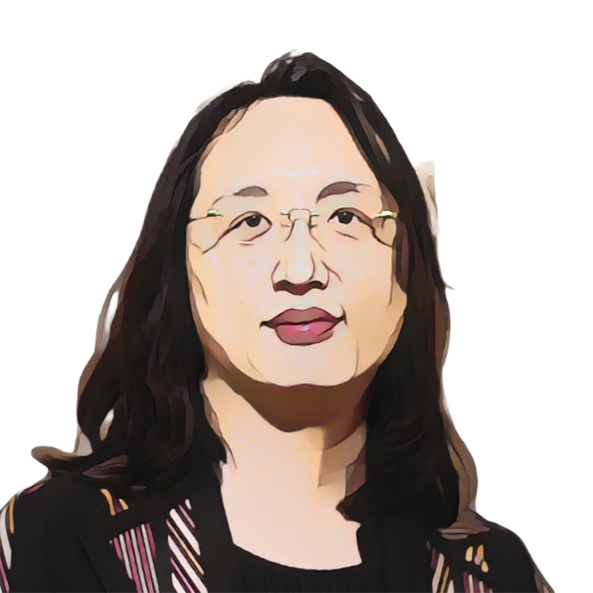

= Audrey Tang

++++

++++

[.posterImage]

[.name]
Audrey Tang

[.title]
Open Source Software, Digital Minister of Taiwan

[.text]
Audrey Tang is a core member of g0v (also known as "gov-zero"), an open-source, open-government movement. Tang believes that technology should be used to improve the abilities of government and to create an involved society. In 2016, Tang took office as Taiwan's Digital Minister, becoming the first non-binary and transgender individual to be appointed to such a position. Born with a congenital heart defect in 1981, Tang was a shy kid and started learning how to program at 8 years old. By age 12 Tang was coding in Perl. At 15, Tang started their own company, serving as chief technical officer for a team of 10 Perl hackers.

[.footer]
--
image:../pioneer-imgs/EquityScaleRigor.png[]

This poster is brought to you by Bootstrap as part of our “Pioneers in Computing and Mathematics” poster library. FREE, research-driven, integrated Computer Science & Data Science modules for Math, Science, Business and Social Studies classes, grades 5-12 at @link{https://www.BootstrapWorld.org, BootstrapWorld.org}.
--
