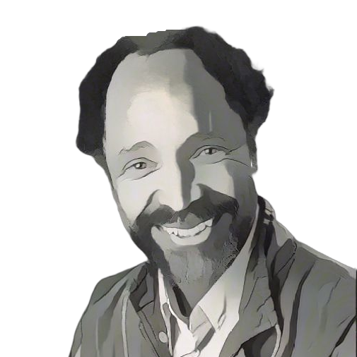

= Clarence "Skip" Ellis

++++

++++

[.posterImage]

[.credit]
Photo courtesy of the University of Colorado, cartoonized using vanceai.com

[.name]
Clarence "Skip" Ellis

[.title]
Computer Scientist, Groupware

[.text]
Ellis was the first African American PhD in computer science. A pioneer of “groupware,” which allows several users to collaborate on a document, he also helped develop the idea of clickable icons. As a teen in Chicago, Ellis guarded a mainframe computer at night and became a self-taught expert by reading the manuals. He earned a scholarship to study Math & Physics at Beloit College, where he helped set up the college's first Computer Lab. Ellis worked at some of the most prestigious companies & universities, including Xerox, IBM, Los Alamos Scientific, Stanford, MIT & UC Boulder. He preferred to teach undergraduates with little experience in Computer Science because he wanted to encourage students of all backgrounds to stretch their academic abilities and consider a career in computer science. Ellis was passionate about civil rights, mentoring students from HBCUs & teaching in Africa.

[.footer]
--
image:../pioneer-imgs/EquityScaleRigor.png[]

This poster is brought to you by Bootstrap as part of our “Pioneers in Computing and Mathematics” poster library. FREE, research-driven, integrated Computer Science & Data Science modules for Math, Science, Business and Social Studies classes, grades 5-12 at @link{https://www.BootstrapWorld.org, BootstrapWorld.org}.
--
