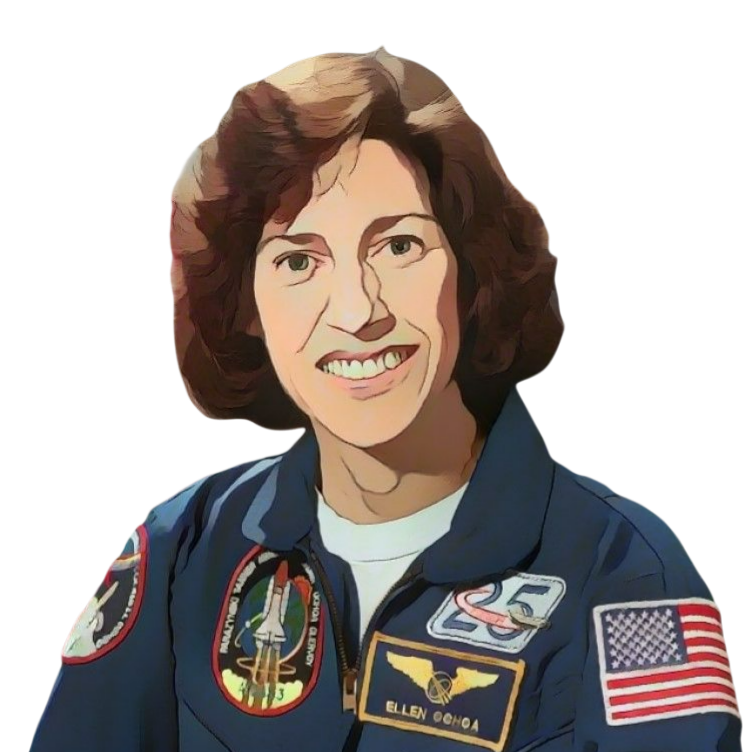

= Ellen Ochoa

++++

++++

[.posterImage]

[.name]
Ellen Ochoa

[.title]
Astronaut, Electrical Engineer, Inventor

[.text]
Ellen Ochoa is a veteran of four NASA Space Shuttle flight missions and was the first Hispanic woman to travel into space. After studying Physics in college, Ochoa considered a career as a classical flutist or in business, but, ultimately, enrolled in graduate school for engineering. In 1983, while Ochoa was working on her PhD in Electrical Engineering, Sally Ride became the first American woman in space, inspiring Ochoa to become an astronaut herself.  Ochoa applied to NASA's astronaut training program several times before she was finally accepted in 1990. In the meantime, she co-invented three optical devices that help scientists to refine images from space and her expertise in optics and computer hardware caught NASA’s attention for their potential to improve the gathering of data and assessing the safety of equipment. Ochoa also participated in an international study of damage to the Earth’s ozone layer and served as the 11th director of the Johnson Space Center.

[.footer]
--
image:../pioneer-imgs/EquityScaleRigor.png[]

This poster is brought to you by Bootstrap as part of our “Pioneers in Computing and Mathematics” poster library. FREE, research-driven, integrated Computer Science & Data Science modules for Math, Science, Business and Social Studies classes, grades 5-12 at @link{https://www.BootstrapWorld.org, BootstrapWorld.org}.
--
