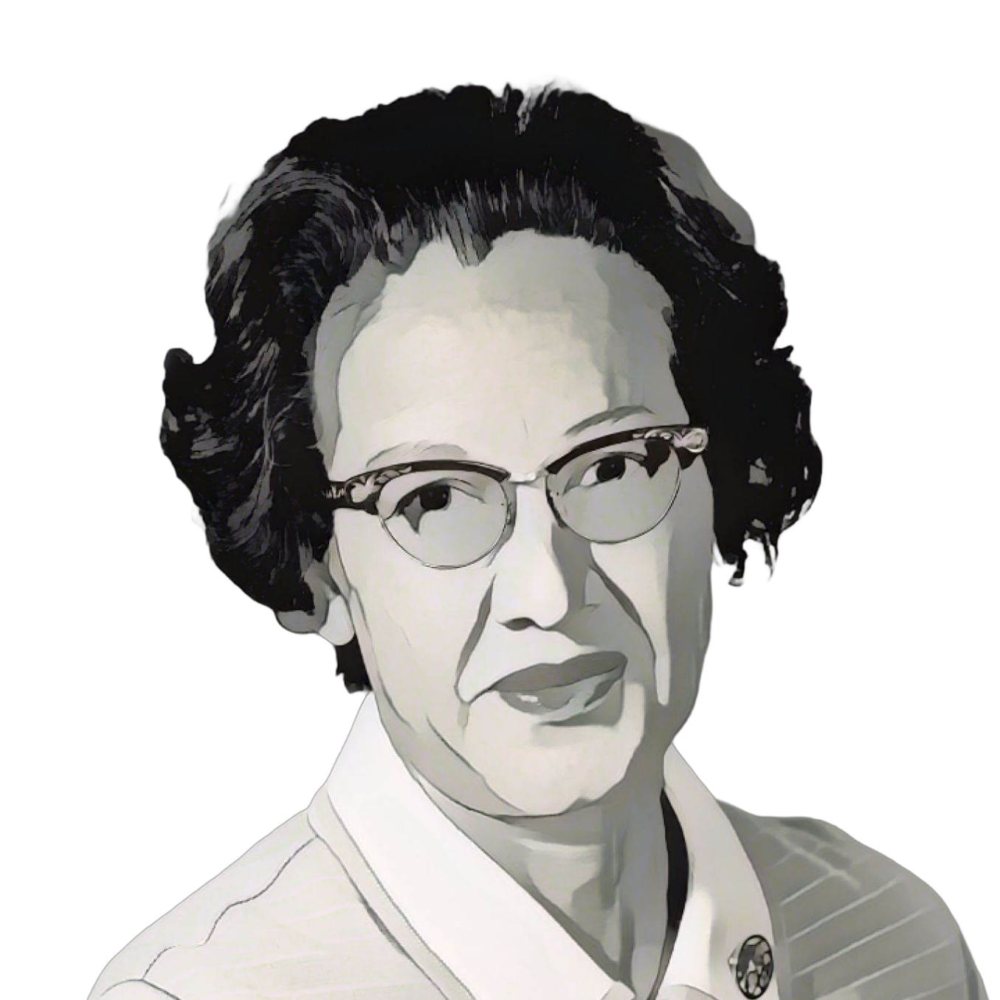

= Katherine Johnson

++++

++++

[.posterImage]

[.name]
Katherine Johnson

[.title]
Mathematician

[.text]
Johnson, who is featured in the 2017 film "Hidden Figures," made a number of significant contributions during her 33 years working in NASA's Flight Research Division. Her work made it possible for John Glenn to orbit the Earth, and she calculated the precise trajectories that would let Apollo 11 land on the moon. Despite these achievements, almost no one knew Johnson's name until decades later, when, in 2015, President Barack Obama awarded Johnson the Presidential Medal of Freedom, proclaiming, “Katherine G. Johnson refused to be limited by society’s expectations of her gender and race while expanding the boundaries of humanity’s reach.”

[.footer]
--
image:../pioneer-imgs/EquityScaleRigor.png[]

This poster is brought to you by Bootstrap as part of our “Pioneers in Computing and Mathematics” poster library. FREE, research-driven, integrated Computer Science & Data Science modules for Math, Science, Business and Social Studies classes, grades 5-12 at @link{https://www.BootstrapWorld.org, BootstrapWorld.org}.
--
