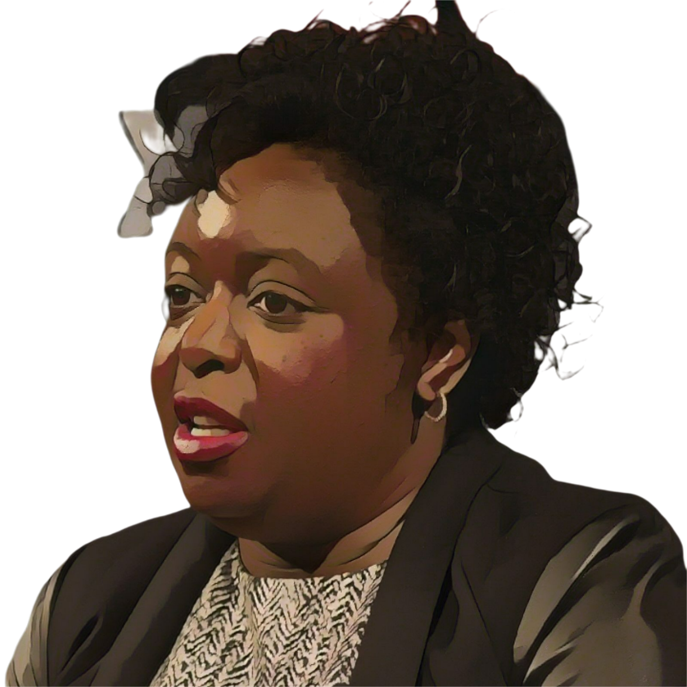

= Kimberly Bryant

++++

++++

[.posterImage]

[.credit]
Image cartoonized using vanceai.com

[.name]
Kimberly Bryant

[.title]
Founder of Black Girls Code, Electrical Engineer

[.text]
Bryant is a self-proclaimed "nerdy girl."  Raised in Memphis, TN by her single mother during the Civil Rights Movement, she always loved and excelled at math and science. Although she initially planned to become a civil engineer, tech such as the microchip, the personal computer, and the cellphone enticed her to switch her focus to electrical engineering.  After earning her degree, Bryant held jobs with companies like Pfizer and Merck until 2011. She decided to launch Black Girls CODE because her daughter expressed an interest in computer programming and all of the available courses were populated mostly by boys.  Bryant hopes that her nonprofit will teach one million Black girls to code by 2040.

[.footer]
--
image:../pioneer-imgs/EquityScaleRigor.png[]

This poster is brought to you by Bootstrap as part of our “Pioneers in Computing and Mathematics” poster library. FREE, research-driven, integrated Computer Science & Data Science modules for Math, Science, Business and Social Studies classes, grades 5-12 at @link{https://www.BootstrapWorld.org, BootstrapWorld.org}.
--
