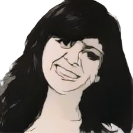

= Laura Gomez

++++

++++

[.posterImage]

[.credit]
Image cartoonized using vanceai.com

[.name]
Laura Gomez

[.title]
Founder & CEO of Atipica (Tech Startup)

[.text]
At age 8, Gomez immigrated to the US from Mexico, settling in Silicon Valley. She was an undocumented immigrant until she was 17, when she attained a work permit and began a software engineering internship at Hewlett Packard. She remembers how she stood out because she was a woman and a minority. She recalls, “I was determined to not let the industry make me into a victim. I decided that I’d work in tech, whether the industry embraced me or not.” She eventually created her own startup, Atipica, which uses AI to help tech companies find and hire diverse candidates in an unbiased manner. 

[.footer]
--
image:../pioneer-imgs/EquityScaleRigor.png[]

This poster is brought to you by Bootstrap as part of our “Pioneers in Computing and Mathematics” poster library. FREE, research-driven, integrated Computer Science & Data Science modules for Math, Science, Business and Social Studies classes, grades 5-12 at @link{https://www.BootstrapWorld.org, BootstrapWorld.org}.
--
