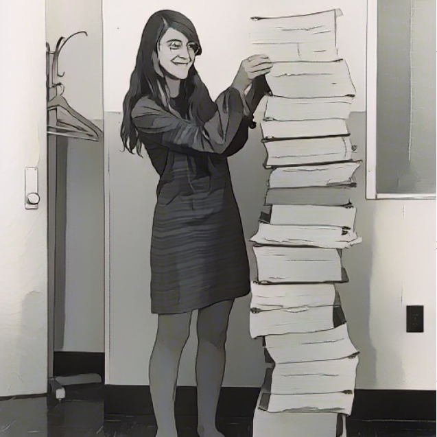

= Margaret Hamilton

++++

++++

[.posterImage]

[.credit]
This image of Hamilton standing next to the software she and her MIT Team produced to send humans to the Moon for the first time with the Apollo Project in 1969 is from the MIT Museum, restored by Adam Cuerden of Draper Laboratory and in the Public Domain. Image cartoonized using vanceai.com

[.name]
Margaret Hamilton

[.title]
Software Engineer

[.text]
Hamilton studied abstract mathematics before joining Edward Norton Lorenz's team in the meteorology deparment at MIT in 1959. There she developed software for predicting weather and contributed to his publications on chaos theory. By 1965 she'd worked in two other MIT labs, and was in charge of all Command Module software for navigating and landing the Apollo Space Mission, which put Neil Armstrong and Edwin "Buzz" Aldrin on the moon in 1969. In addition to developing in-flight software, Hamilton's team was responsible for error detection and recovery software such as restarts and Priority Displays. These made her code incredibly reliable because they helped programmers identify and fix anomalies before they became major problems. Hamilton is among those credited with developing the term software engineering and earning recognition for it as a discipline in its own right. She earned the Presidential Medal of Freedom in 2016, received the Computer History Museum Fellow Award in 2017, and was featured in the Women of NASA LEGO set.

[.footer]
--
image:../pioneer-imgs/EquityScaleRigor.png[]

This poster is brought to you by Bootstrap as part of our “Pioneers in Computing and Mathematics” poster library. We offer FREE, research-driven, integrated Computer Science & Data Science modules for Math, Physics, Business and Social Studies classes, grades 5-12 at @link{https://www.BootstrapWorld.org, BootstrapWorld.org}.
--
