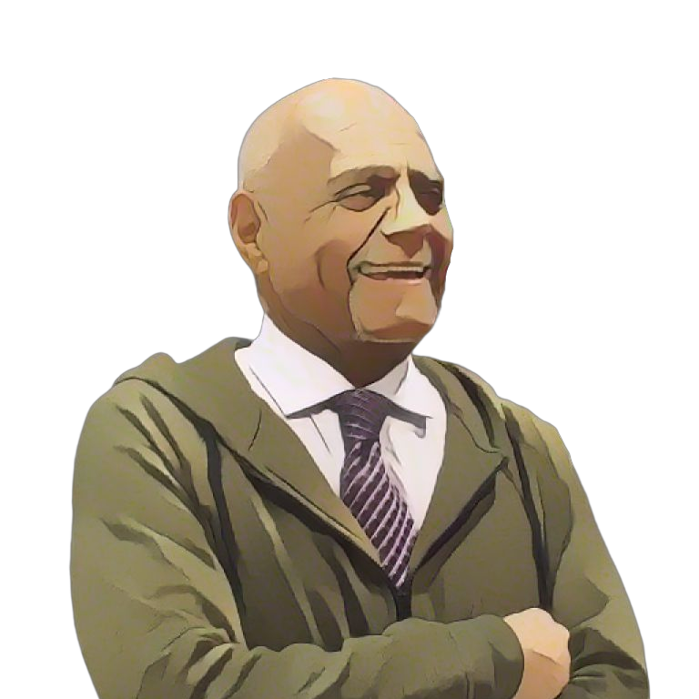

= Robert Moses

++++

++++

[.posterImage]

[.credit]
This image is from the Princeton Public Library and licensed under the Creative Commons Attribution 2.0 Generic license.

[.name]
Robert Moses

[.title]
Educator and Civil Rights Leader

[.title]
Algebra Project Founder

[.text]
Born in 1935, Moses was raised in Harlem, where he played basketball and attended public schools. He returned to NYC to teach math after earning his MA in philosophy from Harvard in 1957. The sit-ins called him to move to Mississippi, where he directed the Student Non-Violent Coordinating Committee’s Mississippi Voter Registration Project from 1961-1964 and was one of the lead organizers of the 1964 Mississippi "Freedom" Summer Project. His work to organize share croppers earned him a MacArther Fellowship in 1982. Believing math literacy to be one of the greatest civil rights issues of our time and a prerequisite for full citizenship in society, Moses used the funds to found the Algebra Project. In addition to organizing communities to create a culture of literacy around Algebra and building a network of youth leaders across the country, Moses developed a pedagogy that roots algebra in concrete lived experiences, which students draw, write about and discuss before developing symbolic representations.

[.footer]
--
image:../pioneer-imgs/EquityScaleRigor.png[]

This poster is brought to you by Bootstrap as part of our “Pioneers in Computing and Mathematics” poster library. We offer FREE, research-driven, integrated Computer Science & Data Science modules for Math, Physics, Business and Social Studies classes, grades 5-12 at @link{https://www.BootstrapWorld.org, BootstrapWorld.org}.
--
