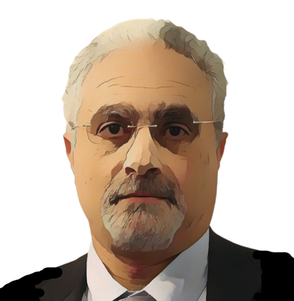

= Taher Elgamel

++++

++++

[.posterImage]

[.name]
Taher Elgamel

[.title]
Security Leader, Cryptographer, CISO, CTO

[.text]
Elgamel is a world-renowned Egyptian-American cryptographer - someone who studies secure communication techniques. He is considered a pioneer of the Secure Sockets Layer (SSL), which allows sensitive information such as credit card numbers, social security numbers, and login credentials to be safely transmitted online. SSL secures millions of peoples’ data on the Internet each day! You can tell that a website is SSL-secured - and you can simultaneously see the impact of Elgamel's work - when a web address begins with "https" rather than "http." 

[.footer]
--
image:../pioneer-imgs/EquityScaleRigor.png[]

This poster is brought to you by Bootstrap as part of our “Pioneers in Computing and Mathematics” poster library. FREE, research-driven, integrated Computer Science & Data Science modules for Math, Science, Business and Social Studies classes, grades 5-12 at @link{https://www.BootstrapWorld.org, BootstrapWorld.org}.
--
