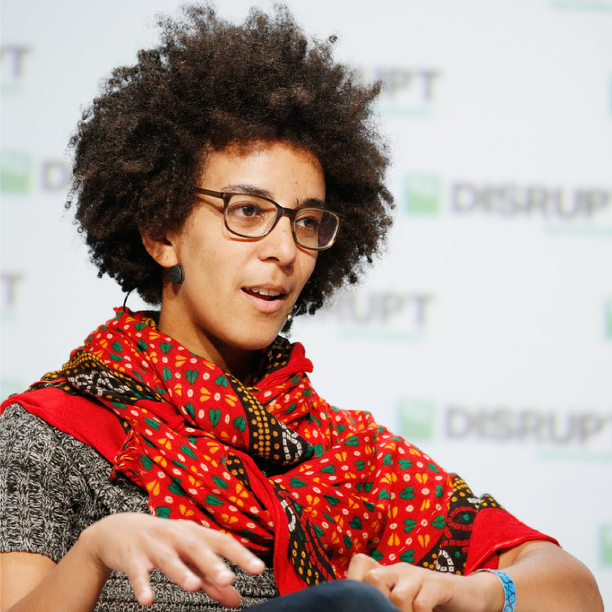

= Timnit Gebru

++++

++++

[.posterImage]

[.credit]
Creator: Kimberly White Credit: Getty Images for TechCrunch Copyright: 2018 Getty Images https://creativecommons.org/licenses/by/2.0/

[.name]
Timnit Gebru

[.title]
Co-founder: Black in AI, Advocate for Diversity in Tech

[.text]
Gebru was born and raised in Adis Ababa, Ethiopia. She fled at 15, during the Eritrean–Ethiopian War. After a brief stint in Ireland, she eventually received political asylum in the US, where she attended high school in Somerville, MA before earning her BS, MS, and PhD from Stanford. Gebru focuses on data mining, artificial intelligence (AI) and algorithmic bias. Her doctoral research won the 2017 LDV Capital Vision Summit competition, starting a series of collaborations with other entrepreneurs and investors. After leaving Apple, Microsoft and Google, she launched the Distributed Artificial Intelligence Research Institute (DAIR) to document the effect of artificial intelligence on marginalized groups, with a focus on Africa and African immigrants in the United States. One of the organization's initial projects plans to analyze satellite imagery of townships in South Africa with AI to better understand legacies of apartheid.

[.footer]
--
image:../pioneer-imgs/EquityScaleRigor.png[]

This poster is brought to you by Bootstrap as part of our “Pioneers in Computing and Mathematics” poster library. We offer FREE, research-driven, integrated Computer Science & Data Science modules for Math, Physics, Business and Social Studies classes, grades 5-12 at @link{https://www.BootstrapWorld.org, BootstrapWorld.org}.
--
