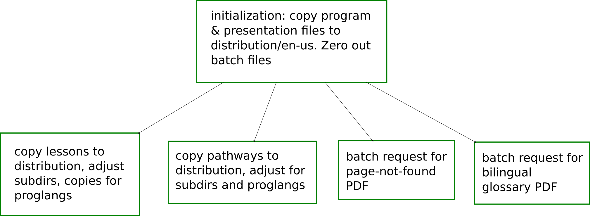
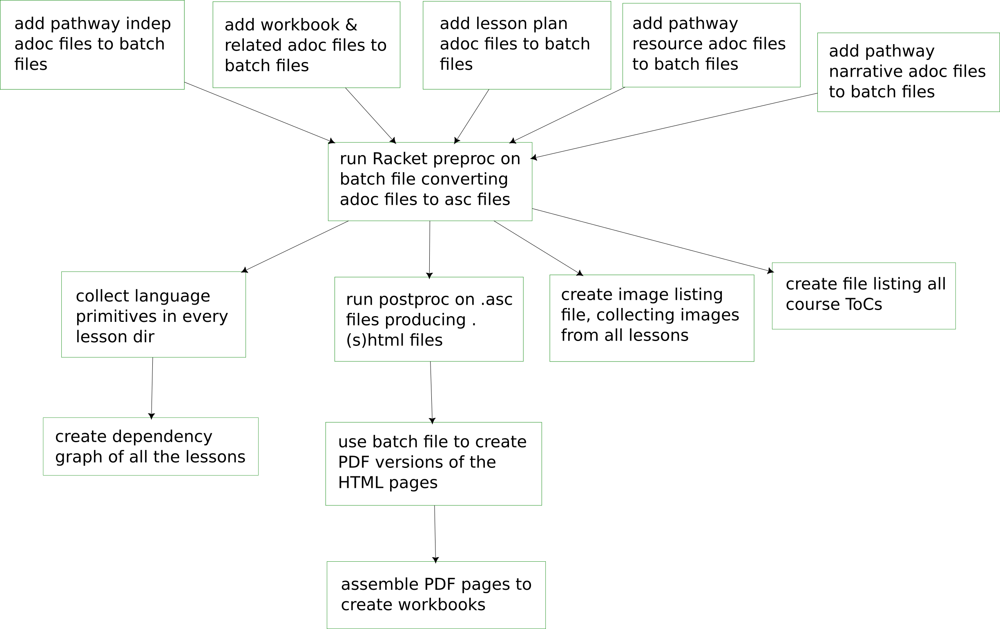

== The build phases

The build is accomplished in two phases, each a Makefile. Because
of the multiplicity of files to keep track of, some generated
during the course of the build, the Makefile rules are themselves
generated using Makefile functions.  However, the input files
needed in the second phase are not available until the first
phase is completed, hence the need to use a separate Makefile for
the two phases.

=== The first build phase

The first phase initializes the distribution directory, then
copies the lessons and pathways over, adjusting subdirectories,
and creating proglang-specific copies as needed. It sets up the
temp files that will contain the input date to run various conversions in
batch mode. Two specific PDFs, the page-not-found and the
bilingual glossary, are requested to start the ball rolling.

=== The second build phase

The second phase does the bulk of the conversions. Requests are
set up in the batch-input files for passing the various adoc
files to the Racket preprocessor, which will create corresponding
asc files.  These are then converted to html files via a batch
call to Asciidoctor.

Different batch files are then used to pick up
primitives, the lesson inter-dependencies, and global image and
pathway-toc listings, and to add some postprocessing.

Finally the postprocessed HTML files are converted to PDFs, and
these are assembled into workbook pages. 

